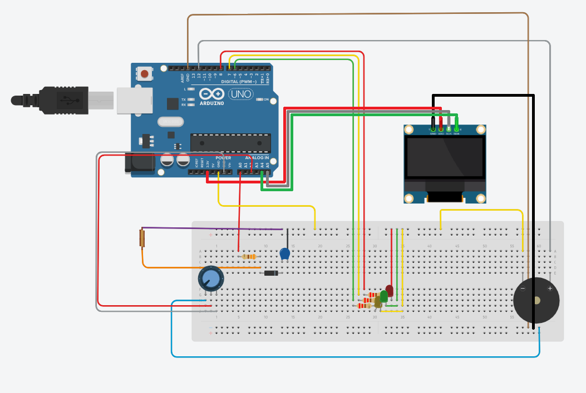
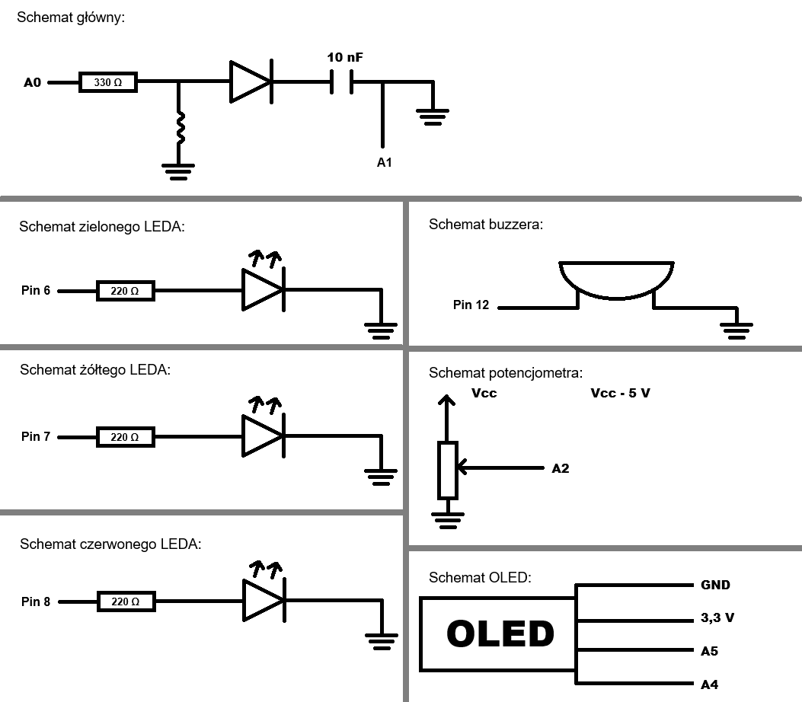

# wykrywacz-metalu-arduino
## Części:
- Arduino Uno R4 WIFI
- cewka ( drut emaliowany około 30 zwojów )
- 3x rezystor 220 Ω
- rezystor 330 Ω
- kondensator 10 nF PAS-04928
- dioda prostownicza 1N4148
- 3x dioda LED (zielona, zółta, czerwona)
- potencjometr b10k
- buzzer TMB12A05
- OLED SSD 1306 128x64

## Opis działania:
Arduino wysyła za pomocą pinu A0 krótkie impulsy napięciowe ( długość 10 mikrosekund), które przechodzą przez układ z cewką.
Pin A1 odczytuje odpowiedź układu na tę napięcie. 
Taki pomiar jest wykonywany 100 razy, a następnie jest z niego obliczona średnia wartość.

- Cewka tworzy pole elektromagnetyczne ( obecnośąć metalu wpływa na indukcyjność cewki, co wpływa na sygnał mierzony przez Arduino)
- Dioda prostownicza prostuje impulsy z cewki ( umożliwia ładowanie kondensatora tylko w jedym kierunku przez co można mierzyć zmiany napięcia od obecności metalu)
- Kondensator magazynuje ładunek elektryczny ( wygładza skoki) w szczególności pozwala na pomiar zmian napięcia

## Schemat nr.1 (przy pomocy tinkecard.com)

## Schemat nr.2

## Budowa wykrywacza metali:
Wykrywacz został zbudowany na bazie rurki z PCV i można go rozłożyć na dwie części. Dolna długa rurka z nawiniętą cewką, zabezpieczoną żółtą taśmą izolacyjną. Górna część to rączka oraz plexi, na której zamocowano Arduino wraz z niezbędnymi układami elektronicznymi. Pod plexi, przymocowanymi na rzepy, znajduje się powerbank zapewniający zasilanie urządzenia.

## Wymiary oraz waga wykrywacza (mogą nie być idealne):
- Długość dolnej części 65 cm
- Długość górnej części 40 cm
- średnica cewki 15 cm
- Szerokość plexi 19,2 cm
- Długość plexi 5,5 cm
- Waga 1,1 kg
